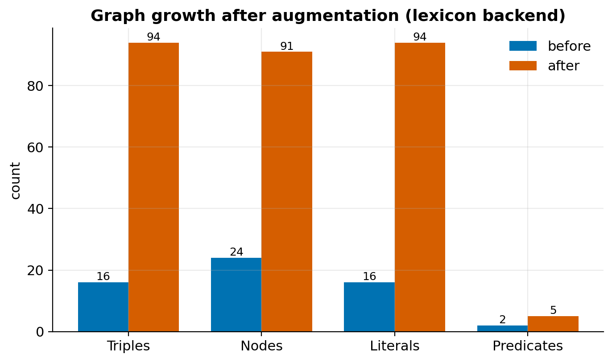
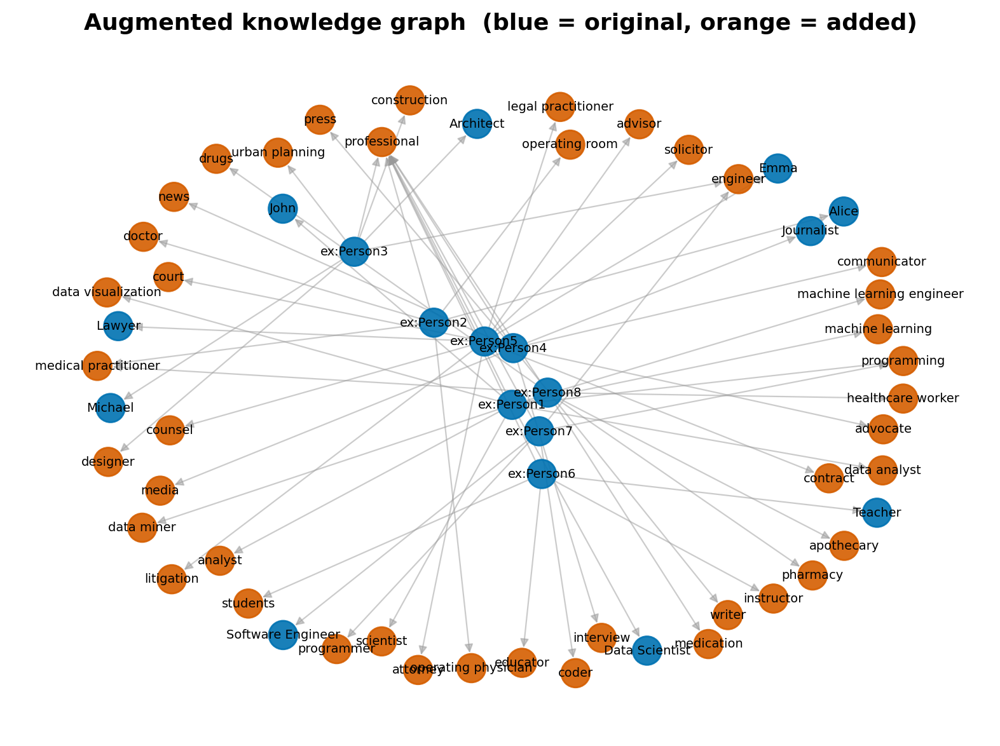

# rdf-augmenter: Ontology-Aware RDF Knowledge Graph Augmentation

> Add synonyms, hypernyms (types) and related concepts to any RDF knowledge
> graph — reproducibly, with provenance, and with SHACL-ready output.

**rdf-augmenter** is an open toolkit for **RDF data augmentation** and
**knowledge graph augmentation**. It enriches sparse RDF graphs with
semantically related terms so that downstream tasks — question answering,
semantic search, link prediction, entity classification, and graph machine
learning — have more signal to work with. It grew out of the research paper
*[Knowledge Graph Augmentation for Increased Question Answering Accuracy](https://doi.org/10.1007/978-3-662-66146-8_3)*
(Martinez-Gil et al., 2022) and is being developed into reusable research
infrastructure for the Semantic Web community.

```bash
pip install rdf-augmenter
```

```python
from rdf_augmenter import RDFAugmenter

aug = RDFAugmenter(seed=42)                                  # reproducible
aug.load("examples/sample_people.ttl")
report = aug.augment(predicates=["http://example.org/occupation"])
aug.export("augmented.ttl")
print(report.summary())                                       # 16 -> 94 triples
```



---

## Why augment an RDF knowledge graph?

Real knowledge graphs are **sparse and incomplete**. A graph may know that
someone is a *"Surgeon"* but not that a surgeon *is a* physician, is *also
called* an operating physician, or is *related to* surgery and hospitals. That
missing context limits accuracy in question answering, weakens semantic search
recall, and starves graph-learning models of training signal.

**Augmentation** adds new, plausible triples — synonyms, broader types
(hypernyms), and related concepts — to make the graph denser and more useful,
without hand-authoring every fact. This is **semantic graph augmentation** and
**knowledge graph preprocessing** for the modern graph-ML and Semantic Web
toolchain.



*Blue nodes are original; orange nodes were added by augmentation.*

## What makes it research-grade?

- **Runs out of the box, deterministically.** The default lexicon backend is
  offline and seedable — tutorials, notebooks and CI run in seconds, with no GPU
  and no model downloads.
- **Pluggable backends.** Swap the deterministic `LexiconBackend` for
  `WordNetBackend` or the published `BertBackend` behind a single interface.
- **Semantic validity is checkable, not just claimed.** Output is designed for
  **SHACL** validation and RDFS/OWL reasoning, with a built-in `attach="concept"`
  mode that emits a valid **SKOS** thesaurus.
- **Provenance built in.** Every run records a W3C **PROV-O** activity; every
  synthetic triple can be reified and traced back to its source term.
- **Reproducible by design.** A `seed` plus a JSON **reproducibility manifest**
  (input hash, parameters, library versions) make any run repeatable.
- **Interoperable.** Export to Turtle, N-Triples, RDF/XML, JSON-LD, TriG, or N3.

## Installation

```bash
pip install rdf-augmenter                 # core (rdflib only)
pip install "rdf-augmenter[viz]"          # + matplotlib, networkx (figures)
pip install "rdf-augmenter[wordnet]"      # + nltk (WordNet backend)
pip install "rdf-augmenter[bert]"         # + transformers, torch (BERT backend)
pip install "rdf-augmenter[shacl]"        # + pyshacl (SHACL validation)
```

Or from source:

```bash
git clone https://github.com/jorge-martinez-gil/rdf-augmenter.git
cd rdf-augmenter
pip install -e ".[dev]"
```

## How do I augment my own graph?

Point it at any RDF file and choose which predicates to augment:

```python
from rdf_augmenter import RDFAugmenter

aug = RDFAugmenter(seed=42)
aug.load("my_graph.ttl")                     # any rdflib-readable RDF
aug.augment(
    predicates=["http://example.org/occupation"],  # which literals to enrich
    relations=("synonym", "hypernym", "related"),    # what to add
    top_k=4,                                          # suggestions per relation
    ratio=1.0,                                        # fraction of literals
)
aug.export("my_graph_augmented.ttl", fmt="turtle")
```

For your own domain, supply a lexicon so augmentation respects your vocabulary:

```python
from rdf_augmenter import RDFAugmenter, LexiconBackend
backend = LexiconBackend(path="my_domain_lexicon.json")
aug = RDFAugmenter(backend=backend, seed=42)
```

## How is semantic validity preserved?

Three complementary mechanisms (see the
[advanced tutorial](docs/tutorials/02-advanced-ontology-aware-augmentation.md)):

1. **Controlled vocabulary.** With a domain lexicon, every added term is one your
   ontology already sanctions.
2. **SKOS thesaurus mode.** `attach="concept"` produces a well-formed SKOS
   structure (`skos:prefLabel`, `skos:altLabel`, `skos:broader`, `skos:related`).
3. **SHACL / RDFS validation.** Validate the augmented graph against your shapes:

   ```python
   from pyshacl import validate
   conforms, _, report = validate(aug.graph, shacl_graph=my_shapes, inference="rdfs")
   ```

## How do I validate the output?

Install `pyshacl`, declare your constraints as SHACL shapes, and check
conformance — wire it into CI to guarantee every augmented graph you publish is
valid. A complete, runnable example is in the
[advanced tutorial](docs/tutorials/02-advanced-ontology-aware-augmentation.md#4-validating-semantic-correctness-with-shacl)
and [exercise 5](docs/exercises.md).

## How do I reproduce the published method?

The method from Martinez-Gil et al. (2022) — BERT fill-mask candidate generation
filtered by embedding similarity — is available as the `BertBackend`:

```python
from rdf_augmenter import RDFAugmenter, BertBackend
aug = RDFAugmenter(backend=BertBackend(model_name="bert-base-uncased"), seed=42)
```

Every run can emit a manifest (`report.save_manifest(...)`) so your own
experiments are reproducible by others. *A one-command benchmark harness for the
downstream question-answering evaluation is on the [roadmap](#roadmap); results
will be generated, never hard-coded.*

## How do I benchmark another augmentation algorithm?

Implement the small `Backend` interface and drop it in — the rest of the
pipeline (loading, provenance, manifests, export, validation, visualization) is
shared, so comparisons are apples-to-apples:

```python
from rdf_augmenter.backends import Backend

class MyBackend(Backend):
    name = "my-method"
    def suggest(self, term, relation_type, top_k=5):
        return [...]   # your related terms

from rdf_augmenter import RDFAugmenter
aug = RDFAugmenter(backend=MyBackend(), seed=42)
```

## Documentation & tutorials

| Resource | What it covers |
|----------|----------------|
| [Beginner tutorial](docs/tutorials/01-beginner-rdf-augmentation.md) | RDF, knowledge graphs, and your first augmentation |
| [Advanced tutorial](docs/tutorials/02-advanced-ontology-aware-augmentation.md) | Ontology-aware augmentation, SHACL/OWL validation, SKOS, provenance |
| [Concepts glossary](docs/concepts.md) | RDF, SPARQL, OWL, SHACL, SKOS, augmentation, completion, provenance |
| [Exercises](docs/exercises.md) | Seven graded, runnable exercises for self-study or classroom |
| [Quickstart notebook](notebooks/01_quickstart.ipynb) | The basics, as a runnable notebook |
| [Visualization notebook](notebooks/02_visualizing_augmentation.ipynb) | Charting the augmentation effect |

Build the docs site locally: `pip install "rdf-augmenter[docs]" && mkdocs serve`.

## How do I cite this?

If you use rdf-augmenter, please cite the software (see [`CITATION.cff`](CITATION.cff))
and the associated article:

```bibtex
@article{martinez2022kgaugmentation,
  author  = {Jorge Martinez-Gil and Shaoyi Yin and Josef K{\"{u}}ng and Franck Morvan},
  title   = {Knowledge Graph Augmentation for Increased Question Answering Accuracy},
  journal = {Trans. Large Scale Data Knowl. Centered Syst.},
  volume  = {52},
  pages   = {70--85},
  year    = {2022},
  doi     = {10.1007/978-3-662-66146-8\_3},
  url     = {https://doi.org/10.1007/978-3-662-66146-8\_3}
}
```

## How do I contribute?

Contributions are welcome — new backends, lexicons, benchmark datasets, and
tutorials especially. See [`CONTRIBUTING.md`](CONTRIBUTING.md).

## Roadmap

Augmentation is the foundation; the broader goal is a benchmark platform for RDF
augmentation. Planned, in priority order: a one-command **benchmark harness**
(link prediction, entity classification, QA) with auto-generated figures and
LaTeX tables; **dataset loaders** for DBpedia, Wikidata, YAGO and Bio2RDF;
**negative-triple generation** and class balancing; a **CLI** and **REST API**;
and **Docker** images. All benchmark results will be generated and reproducible —
never fabricated.

## License

MIT — see [`LICENSE`](LICENSE). © 2024 Jorge Martinez-Gil.
